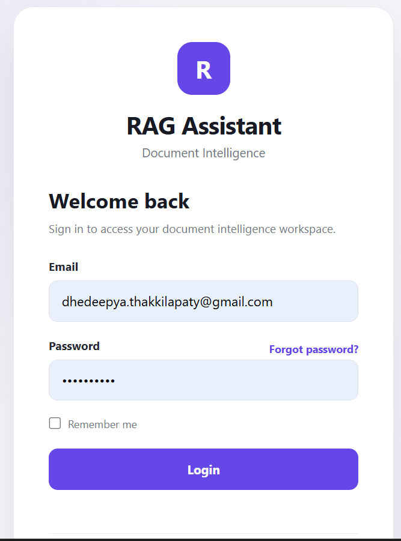
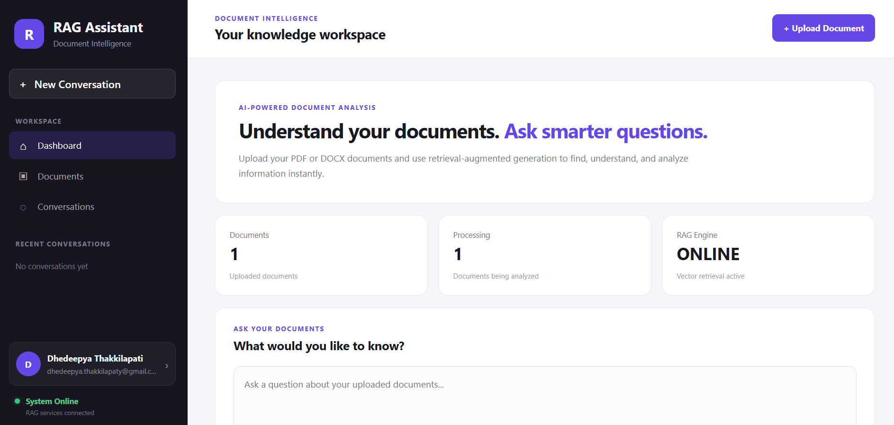
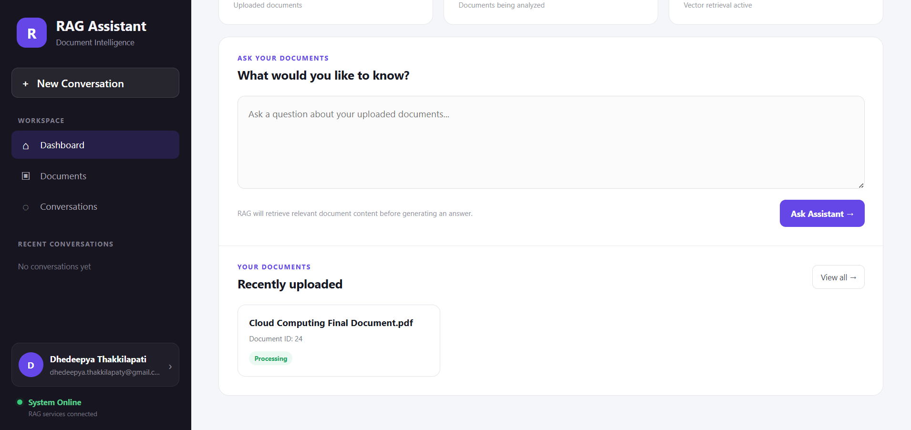
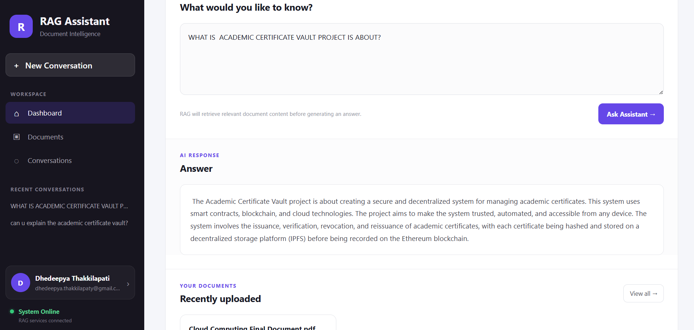

# 🤖 RAG-Powered Document Intelligence Assistant

## 📌 1. Project Overview

The **RAG-Powered Document Intelligence Assistant** is an intelligent document processing and question-answering system built using **Retrieval-Augmented Generation (RAG)**.

The system allows users to upload PDF and DOCX documents, process their content, generate vector embeddings, store them in a vector database, retrieve relevant information, and generate answers using an AI language model.

---

## 🏗️ 2. Architecture

```text
                         ┌──────────────────────┐
                         │      Frontend        │
                         │    Web Dashboard     │
                         └──────────┬───────────┘
                                    │
                                    ▼
                         ┌──────────────────────┐
                         │     Spring Boot      │
                         │      REST API        │
                         └──────────┬───────────┘
                                    │
                                    ▼
                         ┌──────────────────────┐
                         │      RabbitMQ        │
                         │  Message Processing  │
                         └──────────┬───────────┘
                                    │
                                    ▼
                         ┌──────────────────────┐
                         │       PySpark        │
                         │ Document Processing  │
                         └──────────┬───────────┘
                                    │
                                    ▼
                         ┌──────────────────────┐
                         │     Scala Spark      │
                         │ Metadata Processing  │
                         └──────────┬───────────┘
                                    │
                                    ▼
                         ┌──────────────────────┐
                         │  Embedding Generation│
                         │  nomic-embed-text   │
                         └──────────┬───────────┘
                                    │
                                    ▼
                  ┌──────────────────────────────────┐
                  │       PostgreSQL + PGVector      │
                  │       HNSW Vector Indexing       │
                  │       Cosine Similarity Search   │
                  └───────────────┬──────────────────┘
                                  │
                                  ▼
                         ┌──────────────────────┐
                         │    RAG Retrieval     │
                         │   Relevant Chunks    │
                         └──────────┬───────────┘
                                    │
                                    ▼
                         ┌──────────────────────┐
                         │    Ollama + Mistral  │
                         │    LLM Generation    │
                         └──────────┬───────────┘
                                    │
                                    ▼
                         ┌──────────────────────┐
                         │   Generated Answer   │
                         └──────────────────────┘
```

---

## ✨ 3. Features

* 📄 PDF and DOCX document upload
* 🔄 Asynchronous document processing using RabbitMQ
* ⚡ PySpark document processing
* 🔹 Scala Spark metadata processing
* ✂️ Document chunking
* 🧠 Vector embedding generation
* 🗄️ PostgreSQL with PGVector
* 🔎 Vector similarity search
* 🚀 HNSW vector indexing
* 📐 Cosine-distance similarity
* 🤖 Retrieval-Augmented Generation
* 🧩 Mistral LLM through Ollama
* 💬 Question answering over uploaded documents
* 🌐 Web-based document intelligence dashboard
* 🐳 Docker-based environment

---

## 🛠️ 4. Technologies Used

| Technology             | Purpose                   |
| ---------------------- | ------------------------- |
| ☕ Java 21              | Backend development       |
| 🌱 Spring Boot         | REST API                  |
| 🧠 Spring AI           | AI integration            |
| 🐇 RabbitMQ            | Asynchronous messaging    |
| ⚡ PySpark              | Document processing       |
| 🔷 Scala Spark         | Metadata processing       |
| 🐘 PostgreSQL          | Database                  |
| 🔎 PGVector            | Vector storage and search |
| 🚀 HNSW                | Vector indexing           |
| 🦙 Ollama              | Local AI runtime          |
| 🤖 Mistral             | Large Language Model      |
| 🧬 nomic-embed-text    | Embedding model           |
| 🐳 Docker              | Containerization          |
| 📦 Maven               | Build management          |
| 🎨 HTML/CSS/JavaScript | Frontend                  |

---

## 📂 5. Project Structure

```text
document-assistant/
│
├── frontend/
│   ├── index.html
│   ├── styles.css
│   └── script.js
│
├── pyspark-service/
│   ├── Dockerfile
│   ├── requirements.txt
│   └── *.py
│
├── scala-service/
│   └── src/
│       └── MetadataProcessor.scala
│
├── src/
│   ├── main/
│   │   ├── java/
│   │   │   └── com/
│   │   │       └── ...
│   │   └── resources/
│   │       └── application.properties
│   │
│   └── test/
│
├── uploads/
├── output/
│
├── Dockerfile
├── docker-compose.yml
├── pom.xml
├── mvnw
├── mvnw.cmd
└── README.md
```

---

## 📋 6. Prerequisites

Before running the project, install:

* ☕ Java 21
* 🐳 Docker Desktop
* 🦙 Ollama
* 🤖 Mistral model
* 🧬 nomic-embed-text model

---

## ▶️ 7. How to Run Locally

### 7.1 📥 Clone the Repository

```bash
git clone https://github.com/Dhedeepya123/rag-powered-document-intelligence-assistant.git
```

### 7.2 📁 Open the Project

Open the cloned `rag-powered-document-intelligence-assistant` folder in VS Code.

### 7.3 🐳 Start Docker Services

Docker Compose starts the required infrastructure and application services.

```bash
docker compose up -d
```

This includes:

* 🐘 PostgreSQL + PGVector
* 🐇 RabbitMQ
* ⚡ PySpark processing service
* ☕ Spring Boot backend
* 🌐 Frontend

### 7.4 🦙 Start Ollama

Make sure Ollama is running and the following models are available:

```text
mistral
nomic-embed-text
```

### 7.5 ☕ Run Spring Boot Backend

From the project root:

```powershell
.\mvnw.cmd spring-boot:run
```

Backend:

```text
http://localhost:8081
```

### 7.6 🌐 Open the Frontend

The frontend is served through Docker.

Open:

```text
http://localhost:5501
```

### 7.7 💬 Use the Application

1. Open the web dashboard.
2. Upload a PDF or DOCX document.
3. Spring Boot receives the document.
4. RabbitMQ triggers processing.
5. PySpark extracts and processes the document.
6. Documents are divided into chunks.
7. Scala Spark processes metadata.
8. `nomic-embed-text` generates embeddings.
9. Embeddings are stored in PGVector.
10. Ask a question through the dashboard.
11. Relevant chunks are retrieved.
12. Mistral generates the answer through Ollama.
13. The answer is displayed on the frontend.

---

## 🐳 8. Docker Instructions

### Start Services

```bash
docker compose up -d
```

### Check Containers

```bash
docker ps
```

### Stop Services

```bash
docker compose down
```

### Stop and Remove Volumes

```bash
docker compose down -v
```

---

## 🔌 9. API Information

### 📄 Document Upload

**Endpoint**

```text
POST /api/documents/upload
```

**Request**

```text
multipart/form-data
```

**Example**

```bash
curl -X POST http://localhost:8081/api/documents/upload -F "file=@document.pdf"
```

### 💬 Question Answering

Users submit questions through the web dashboard. The system performs vector similarity search, retrieves relevant document chunks, and provides the retrieved context to the language model to generate the final answer.

---

## 🖼️ Screenshots

### 🔐 Login



### 🏠 Dashboard



### 📊 Dashboard — Document Processing



### 🤖 Question & Answer



---

## 🔄 11. RAG Workflow

```text
📄 Document Upload
        ↓
☕ Spring Boot REST API
        ↓
🐇 RabbitMQ
        ↓
⚡ PySpark Processing
        ↓
✂️ Document Chunking
        ↓
🔷 Scala Spark Metadata Processing
        ↓
🧬 Embedding Generation
        ↓
🗄️ PostgreSQL + PGVector
        ↓
🚀 HNSW Vector Search
        ↓
🔎 Relevant Document Chunks
        ↓
❓ User Question
        ↓
🧬 Query Embedding
        ↓
🔎 Similarity Search
        ↓
🤖 Mistral via Ollama
        ↓
💬 Generated Answer
        ↓
🌐 Frontend
```

---

## 🚀 12. Future Improvements

* 🧠 Improved semantic chunking
* ⚡ More scalable distributed document processing
* 🔧 Independent processing services
* 🔎 Advanced retrieval strategies
* 🔐 Authentication and authorization
* 📊 Monitoring and observability
* 📄 Support for additional document formats
* 🧪 Advanced RAG evaluation
* ☁️ Cloud deployment
* 📈 Improved scalability

---

## 👩‍💻 13. Author

**Dhedeepya123**

---

## ⭐ Project Summary

The **RAG-Powered Document Intelligence Assistant** demonstrates an end-to-end intelligent document question-answering workflow by combining:

**Spring Boot + RabbitMQ + PySpark + Scala Spark + PostgreSQL + PGVector + HNSW + Ollama + Mistral + nomic-embed-text + Docker**

The system processes documents, creates embeddings, performs vector retrieval, and generates context-aware answers using Retrieval-Augmented Generation.
